# README

# Olist E-Commerce 고객 이탈 구조 분석

> **“고객은 언제 떠나는가”** — 구매 리듬 기반 이탈 분석 및 세그먼트 전략 설계
> 

---

## 프로젝트 개요

브라질 최대 이커머스 플랫폼 Olist의 공개 데이터를 활용해,

**고객 이탈이 언제·왜 시작되는지**를 데이터 기반으로 분석한 프로젝트이다.

단순히 이탈 여부를 예측하는 것이 아니라,고객의 **구매 패턴(리듬)**과 **경험 품질(배송·리뷰)**을 중심으로

이탈의 구조적 원인을 규명하는 데 목적이 있다

| 항목 | 내용 |
| --- | --- |
| 데이터 | Olist Brazilian E-Commerce Dataset (Kaggle) |
| 기간 | 2016.09 ~ 2018.10 |
| 고객 수 | 99,441명 (customer_unique_id 기준) |
| 주문 수 | 93,358건 (delivered 상태) |
| 사용 기술 | PostgreSQL · Python · Pandas · Statsmodels  |

---

## 문제 정의

> **고객 이탈은 언제 시작되는가?**
> 

- 첫 구매 이후 고객은 언제 이탈하는가?
- 재구매 고객은 어떤 시점에서 이탈하는가?
- 이탈은 금액, 경험, 구매 패턴 중 무엇에 의해 결정되는가?

---

## 분석 구조

```
1. 문제 정의  
2. 데이터 파이프라인 
3. 전체 구조 분석           (Funnel + Cohort)
4. 이탈 정의 
5. 핵심 가설 도출           
6. 세그먼트 구조      lifecycle / behavior / value / churn_type
7. 원인 분석 (정량: 회귀)      Chi-square · t-test · 로지스틱 회귀
8. 원인 분석 (정성: 감정 분석)  Early churn / Loyal churn 별도 분석
9. 전략 제안        
```

---

## 데이터 파이프라인

```sql
orders (raw)
    ↓
orders_clean       -- delivered 필터 · NULL 제거 · 이상값 제거
    ↓
order_gap          -- LAG 함수로 주문 간격 계산
    ↓
customer_summary   -- 고객별 집계 (first/last order, order_count, avg_gap)
    ↓
customer_features  -- 최종 마트 (churn 변수 + segment + total_revenue)
```

**주의사항**

- `customer_unique_id` 사용 (customer_id는 주문별 재생성되는 값)

- reference_date = `2018-10-30` (데이터 마지막 시점 기준, MAX 동적 계산)

- 음수 주문 간격 · NULL 제거 후 count 동일 → Olist 원본 데이터 이상 없음

---

## 핵심 컬럼 설명

| 컬럼 | 설명 |
| --- | --- |
| `customer_unique_id` | 실제 고객 ID |
| `first_order_date` | 첫 구매일 (코호트 기준) |
| `last_order_date` | 마지막 구매일 (이탈 판단 기준) |
| `order_count` | 총 구매 횟수 |
| `avg_order_gap` | 평균 구매 간격 (일) |
| `days_since_last` | 기준일 대비 마지막 구매 후 경과일 |
| `total_revenue` | 총 결제 금액 (order_payments.payment_value) |
| `churn_90` | 90일 기준 이탈 정의 (독립적 변수) |

---

## 전체 구조 분석

#### Funnel 분석 결과

```
1회+ 구매   93,358명  (100%)
2회+ 구매    2,801명  (3%)    ← 여기서 97% 이탈
3회+ 구매      228명  (0.24%)
5회+ 구매       19명  (0.02%)
Churn       87,048명  (93.2%)
```

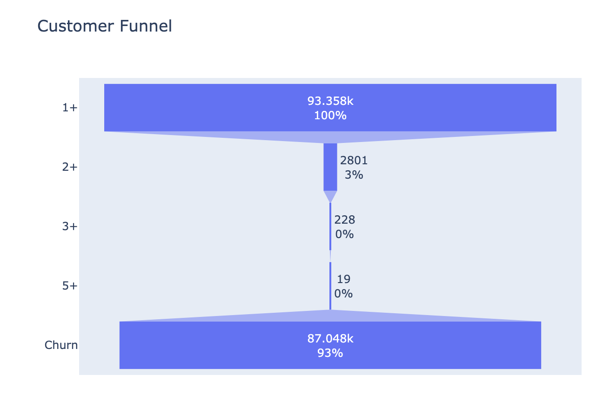

#### Cohort 분석 결과

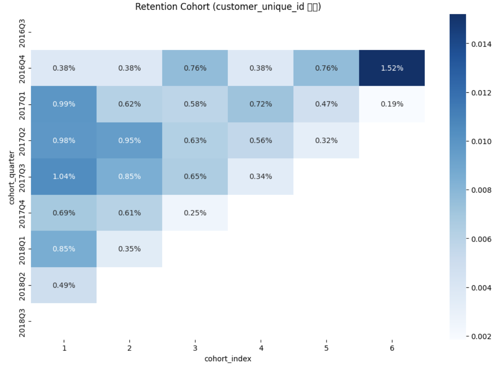

**Insight 1**

전체 고객의 대부분이 단발성 구매에 그치며, 첫 구매 이후 재방문율이 1% 내외로 매우 낮은 구조를 보인다.

**Insight 2**

코호트 간 retention 개선 추세가 관찰되지 않아 고객 경험 또는 리텐션 전략이 부족한 상태로 판단된다.

---

## 이탈 정의

```
이탈 정의는 분석 목적에 따라 두 가지 기준을 독립적으로 설계하였다.

churn_90 — 통계 검정용

정의: 마지막 구매 이후 90일 이상 경과 시 이탈 (1), 아닐 시 비이탈 (0)
목적: 가설 검정 및 로지스틱 회귀의 종속변수. 전체 고객에 동일 기준을 적용하기 위해 
		 단일 임계값 사용
근거: days_since_last 분포의 75~90 percentile이 약 90일 수준 
		→ 대부분의 재구매는 90일 이내 발생

lifecycle — 세그먼트 전략용

정의: 고객의 구매 패턴(구매 횟수, 구매 간격)을 반영한 다단계 이탈 기준
목적: 고객별 구매 리듬이 다르기 때문에 동일 기준 적용 시 오분류 발생. 세그먼트 기반 전략 설계를 위해 개인화 기준 적용
기준: 
	① 단일 구매 고객 (order_count = 1)
	정의: 첫 구매 이후 90일 이상 재구매가 없는 경우 이탈
	근거: days_since_last 분포의 75~90 percentile이 약 90일 수준으로 나타남
			 → 대부분의 재구매는 90일 이내 발생
	
	② 재구매 고객 (order_count ≥ 2)
	정의: 마지막 구매 이후 경과 기간이 평균 구매 간격(avg_order_gap)의 1.5배 초과 시 
	     이탈 위험(Dormant), 3배 초과 시 이탈 확정(Churn)
	보정: g = max(avg_order_gap, 30) 으로 최소 구매 주기 설정
	근거: gap = 0 케이스가 다수 존재하여 median(32일) 기반 하한 적용. 
			 avg_order_gap 배수별 churn rate 분석 결과, 3배 시점에서 이탈 비율이 급격히 증가
	
	③ 장기 이탈 고객 (Loyal churn)
	정의: avg_order_gap의 3배 초과 시 확정 이탈
	의미: 정상 구매 리듬에서 완전히 이탈한 상태로, 단순 휴면과 구별되는 구조적 이탈로 판단
```

---

## 핵심 가설 도출

```python
Funnel 및 Cohort 분석을 통해 다음과 같은 가설을 설정하였다.
H1. 고객의 구매 리듬이 이탈을 설명할 것이다.
H2. 구매 금액은 이탈에 큰 영향을 줄 것이다.
H3. 고객 경험(배송, 리뷰)이 이탈의 주요 원인일 것이다.
```

#### 이탈 행동 기반 분석 - 로지스틱 회귀

- 2회 이상 구매 고객 필터링
- 독립 변수 : 'avg_order_gap', 'order_count', 'total_revenue’
- 종속변수 : ‘churn_90’

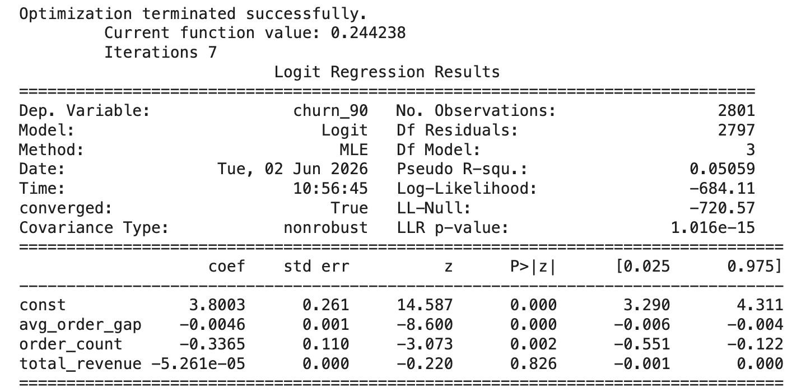

#### 결론

**① 구매 리듬이 이탈을 결정한다  ( H1 채택 )**

avg_order_gap (coef = −0.0046, p < 0.001) — 구매 간격이 길수록 이탈 확률 증가.

Fast 그룹 churn rate 12% vs Slow 그룹 35%, Chi-square p < 0.05로 검증.

**② VIP도 떠난다 — 금액은 이탈을 막지 못한다  ( H2 기각 )**

total_revenue p = 0.826 (완전 비유의).

VIP · Mid · Low 세그먼트 모두 churn rate 93% 이상으로 수렴.

**③ 반복 구매가 진짜 안정성 지표다 (H1 채택)**

order_count (coef = −0.3365, p = 0.002) — 구매 횟수가 많을수록 이탈 감소.

loyalty indicator로 활용 가능

---

## 세그먼트 구조

세그먼트 기준은 임의로 설정하지 않고, 요약통계(percentile)기반으로 데이터에서 도출했다.

| segment_type | value |
| --- | --- |
| lifecycle (기본) | New / Early Risk / Active / Dormant / Churn |
| value (매출 기준) | VIP / Mid / Low |
| behavior (재구매 패턴) | Fast / Normal/Slow |
| churn_type (이탈 유형) | Early / Loyal |

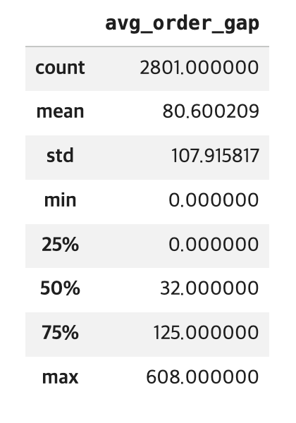

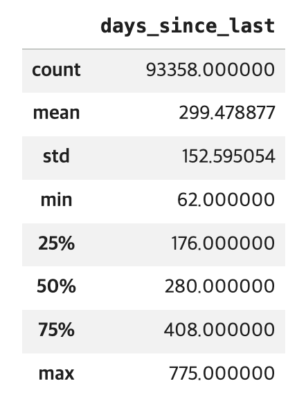

### 1. Lifecycle 세그먼트

고객을 구매 횟수 기준으로 먼저 분리한 뒤, 각 그룹의 통계 분포에 맞는 기준을 적용했습니다.

**[1] 첫 구매 고객 (order_count=1 , 전체의 93.9%)**

`days_since_last` 요약통계 기반 기준 설정:

`25% = 176일 · median = 280일 · 75% = 408일`

| 세그먼트 | 기준 | 의미 |
| --- | --- | --- |
| New | days_since_last ≤ 90일 | 최근 구매 · 이탈 판단 유보 |
| Early Risk | 90일 < days_since_last ≤ 180일 | 이탈 위험 신호  |
| Early Churn | days_since_last > 180일 | 장기 미구매 · 이탈로 판정 |

**[2] 재구매 고객 (order_count ≥ 2 · 전체의 6.1%)**

`avg_order_gap` 요약통계 기반 기준 설정:

`25% = 0일 · median = 32일 · mean = 80일 (왜곡됨)`

> **gap = 0 처리:** 동일 고객의 gap=0 케이스가 다수 존재.
> 
> 
> 실제 재구매 고객의 typical gap은 median=32일이므로,
> 
> `g = max(gap, 30)` 으로 하한을 설정해 노이즈 제거.
> 

| 세그먼트 | 기준 | 의미 |
| --- | --- | --- |
| Active | days_since_last ≤ 1.5g | 평균 + 50% 허용 · 정상 구매 리듬 |
| Dormant | 1.5g < days_since_last ≤ 3g | 평균에서 200% 이내 이탈 · 관찰 필요 |
| Loyal Churn | days_since_last > 3g | 정상 주기 3배 초과 · 이탈로 판정 |

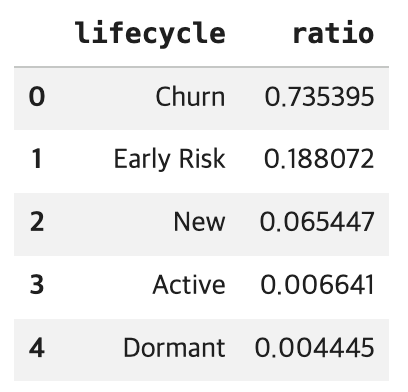

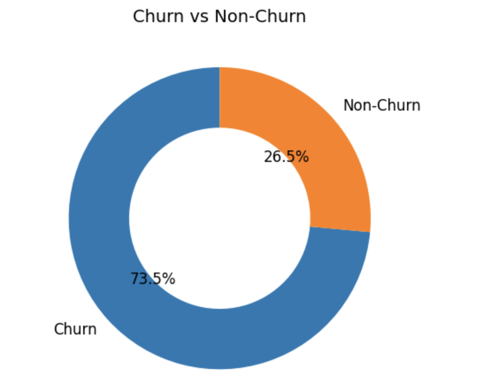

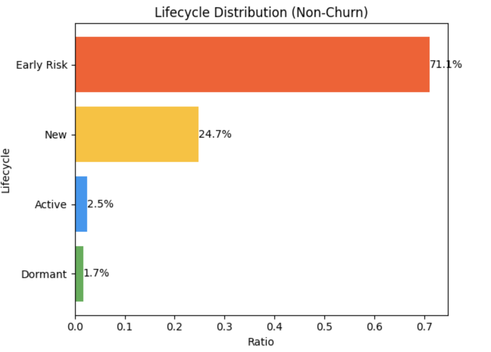

### 2. Churn type 세그먼트

| 유형 | 기준 | 고객 수 |
| --- | --- | --- |
| Early churn | order_count = 1  재구매 없이 이탈 | 84,610명 |
| Loyal churn | order_count ≥ 2 재구매 후 이탈 | 3,843명 |
| Non-churn | 이탈 아님 | 8,230명 |

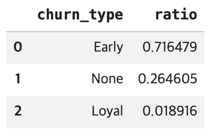

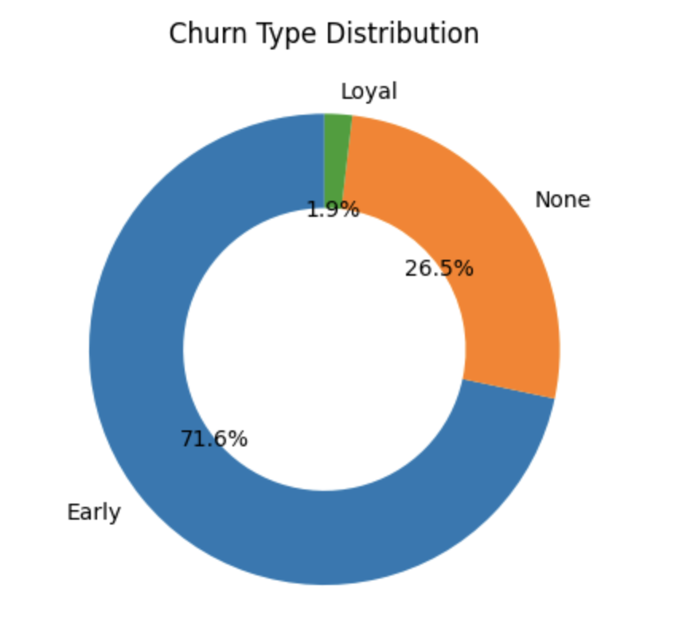

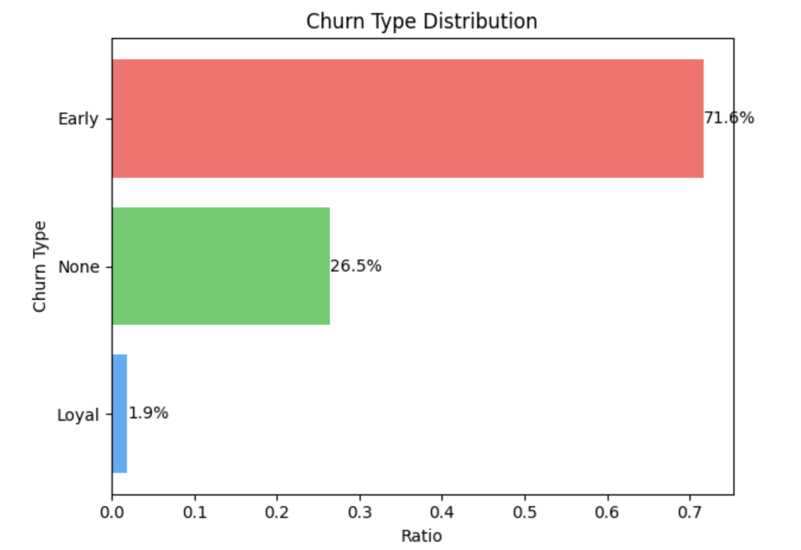

### 3. Behavior 세그먼트

- avg_order_gap 기준
- median = 32일

| 세그먼트 | 기준 | 의미 |
| --- | --- | --- |
| Fast | g ≤ 30일 | 보정 하한과 같음 → 매우 짧은 주기의 고빈도 구매자 |
| Normal | 30일 < g ≤ 90일 | 월 단위 구매 · 일반적인 재구매 리듬 |
| Slow | g > 90일 | 장주기 구매자 · 이탈 위험 높은 그룹 |

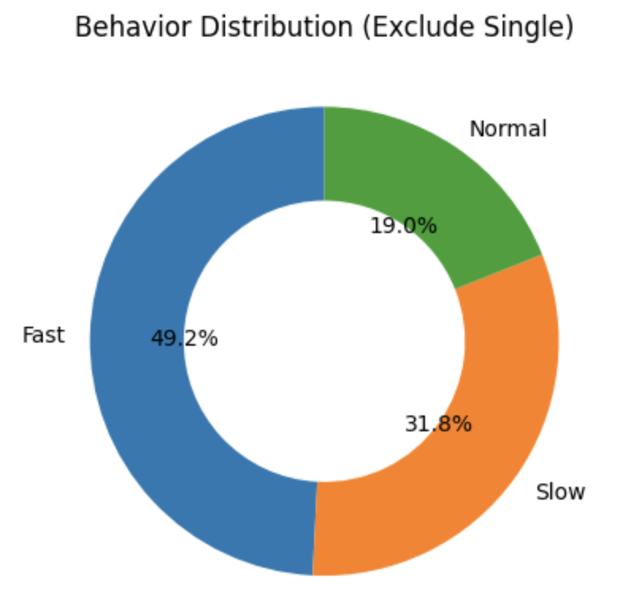

#### 4. value 세그먼트

| 세그먼트 | 기준( 분위수 기반) | 고객 비율 | 평균 매출 | 중앙값 |
| --- | --- | --- | --- | --- |
| Low | total_revenue ≤ R$ 71.63 | 30% | R$ 48 | R$ 48 |
| Mid | R$ 71.63 ~ R$ 167.75 | 40% | R$ 114 | R$ 111 |
| VIP | total_revenue ≥ R$ 167.75 | 30% | R$ 373 | R$ 259 |

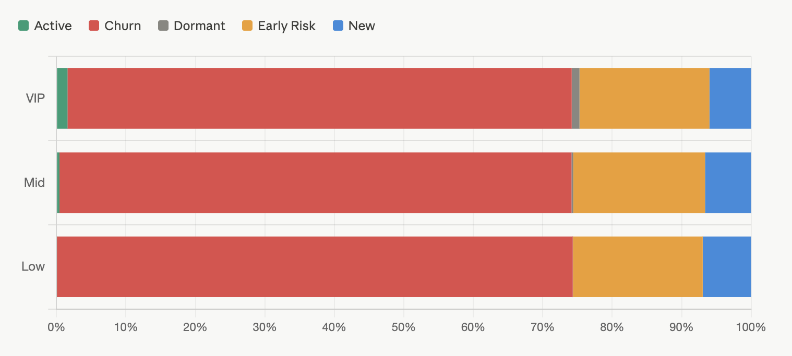

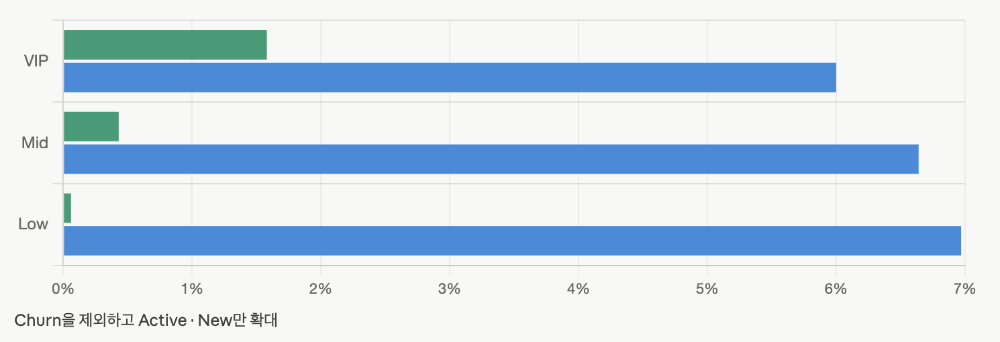

- Churn이 72~74%로 압도적인 매출을 띄고 있다.
- VIP의 Active 비율(1.58%)이 Low(0.06%)보다 약 26배 높다. 단, 절대 수치 자체가 워낙 작아서  "VIP가 이탈을 덜 한다"는 결론을 내리기엔 부족하다.

---

## 이탈 원인 분석 (정량)

churn type을 종속변수로 한 로지스틱 회귀를 통해 이탈에 영향을 미치는 주요 요인을 분석했다. 

주요 변수

- 배송 지연 여부 (is_delayed)
- 리뷰 점수 (review_score)
- 구매 금액 (total_revenue & value segment)

#### Total Revenue (t-test)

```
H0: 이탈 고객과 비이탈 고객의 평균 구매 금액은 차이가 없다. 
H1: 이탈 고객과 비이탈 고객의 평균 구매 금액은 차이가 있다.

결과:
t-stat: -7.20
p-value: 6.22e-13 (< 0.05) -> 귀무가설 기각

해석:
Churn과 Non-Churn 고객 간 평균 구매 금액에는 유의한 차이가 존재한다.
Churn 고객은 Non-Churn 고객보다 구매 금액이 낮으며,
이는 매 금액 수준이 낮은 고객군에서 이탈 비율이 상대적으로 높게 나타나는 경향이 있음을 시사한다.

```

#### Value Segment vs Churn(카이제곱)

```
H0: 고객 가치 수준은 이탈에 영향을 미치지 않는다.
H1: 고객 가치 수준은 이탈에 영향을 미친다.

결과:
chi² = 55.59
p-value = 8.49e-13 (< 0.05) -> 귀무가설 기각

📊 Contingency Table
churn              0      1
value_segment              
Low             7237  20867
Mid            10089  28099
VIP             8615  21776

해석:
고객 가치(구매 금액)는 이탈에 영향을 주지만,
감소폭이 크지는 않아 영향력은 제한적이며 단독으로 이탈을 설명하기에는 부족하다.
```

> **핵심 결론:** “고객은 많이 써도 떠난다 — 진짜 원인은 따로 있다” (H2 기각)
> 

#### 리뷰 점수 vs Churn (t-test)

```
H0: Churn vs Non-Churn 평균 리뷰 점수는 차이가 없다.
H1: Churn vs Non-Churn 평균 리뷰 점수는 차이가 있다.

결과: 
t-stat: -20.31
p-value: 2.43e-91 (< 0.05)  -> 귀무가설 기각

해석:
이탈 고객의 리뷰 점수는 통계적으로 낮지만, 
두 집단 모두 평균이 4점 이상으로 높아 
별점만으로 이탈 원인을 충분히 설명하기는 어렵다.
hurn 그룹의 avg_gap이 non-churn보다 유의미하게 긴 것 
```

#### 배송 지연 vs Churn (카이제곱)

```
H0: 배송 지연 여부와 고객 이탈은 서로 독립이다 (관련이 없다).
H1: 배송 지연 여부와 고객 이탈은 서로 독립이 아니다 (관련이 있다).

결과: 
chi²: 159.31
p-value: 1.60e-36 (< 0.05)

해석:
배송이 지연된 고객의 이탈 비율이 더 높게 나타났으며,
이는 배송 경험이 고객 유지에 중요한 영향을 미친다는 것을 의미한다.
```

> **핵심 결론:** “이탈은 만족도가 아니라 경험 품질(특히 배송)에 의해 결정된다”
> 

#### 로지스틱 회귀

```
Optimization terminated successfully.
         Current function value: 0.579489
         Iterations 5
                           Logit Regression Results                           
==============================================================================
Dep. Variable:                  churn   No. Observations:                96028
Model:                          Logit   Df Residuals:                    96024
Method:                           MLE   Df Model:                            3
Date:                Mon, 08 Jun 2026   Pseudo R-squ.:                0.004431
Time:                        11:00:09   Log-Likelihood:                -55647.
converged:                       True   LL-Null:                       -55895.
Covariance Type:            nonrobust   LLR p-value:                4.855e-107
================================================================================
                   coef    std err          z      P>|z|      [0.025      0.975]
---------------------------------------------------------------------------------
const             1.4674      0.029     49.759      0.000       1.410      1.525
total_revenue    -0.0002   2.92e-05     -8.356      0.000      -0.000     -0.000
review_score     -0.1043      0.006    -16.316      0.000      -0.117     -0.092
is_delayed        0.1878      0.031      6.062      0.000       0.127      0.249
================================================================================

모델 해석:
Pseudo R² = 0.0044 -> 설명력은 낮음 
LLR p-value = 4.85e-107 (< 0.05) -> 모델 전체는 유의미함

영향력 순위
1위: is_delayed (배송 지연)
coef: +0.1878
odds ratio: 1.21
해석:
배송이 지연되면 → 이탈 확률이 약 21% 증가

2위: review_score (리뷰 점수)
coef: -0.1043
odds ratio: 0.90
해석:
리뷰 점수가 1점 증가할 때 → 이탈 확률 약 10% 감소

3위: total_revenue (총 매출) 
coef: -0.0002
odds ratio: 0.9998
해석:
구매 금액 증가 → 이탈 감소
BUT
영향력 거의 없음 

```

> **핵심 결론:** 고객은 돈 때문이 아니라 경험 때문에 떠난다
> 

#### 통합 해석

- 이탈 행동 기반 분석 로지스틱 회귀 결과,
구매 간격과 구매 횟수는 이탈을 유의하게 설명하는 핵심 변수로 나타났다.
→ 이탈은 **고객 행동의 점진적 변화 과정**에서 발생
- 반면, 배송 지연과 리뷰 점수는 이탈과 유의한 관계를 보였으며
→ 이는 **고객 경험이 이탈을 촉발하는 요인**임을 시사

또한 구매 금액은 집단 간 차이는 존재하지만, 이탈을 설명하는 핵심 변수로는 작용하지 않았다.

H3는 통계적으로 유의하였으나, 설명력이 제한적이므로 고객 경험은 이탈의 직접적인 원인이라기보다 이탈을 촉진하는 요인으로 해석하였다. **(H3 부분 채택)**

---

## 이탈 원인 분석 (정성)

**리뷰 점수만으로는 이탈 원인을 충분히 설명하기 어려워 리뷰 감성 분석 실시하였다.**

- Early / Loyal / Non-churn 세그먼트별 3점 기준으로 나눠 감성분석한 후 키워드 추출

1. **세그먼트별 4점 기준 점수별 차이**

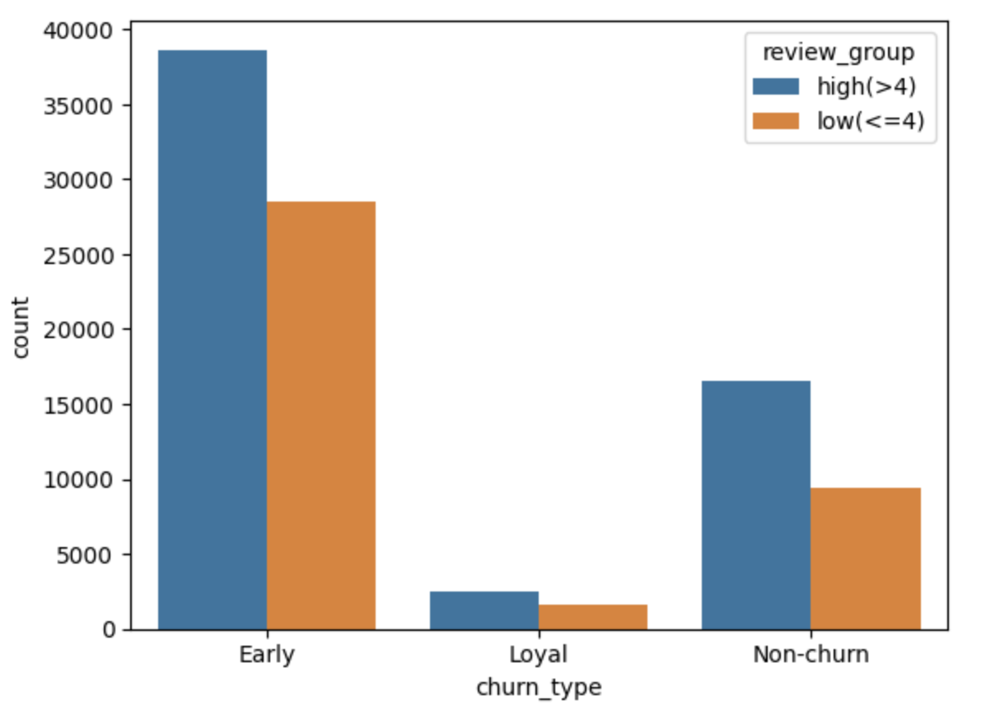

1. **Churn Type별 감성 분석 키워드** 
- Early churn + Negative

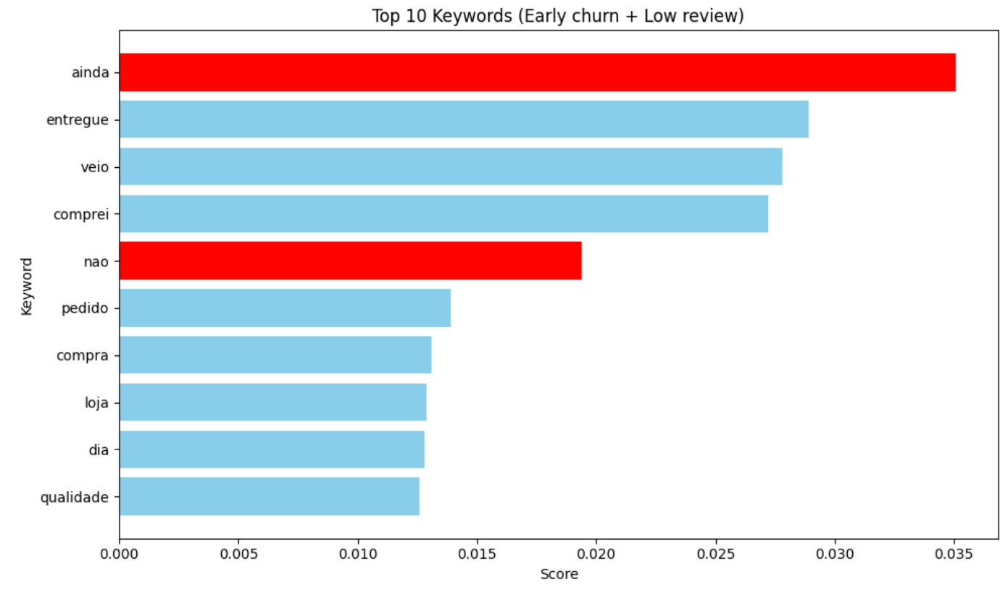

- nao / nada → 강한 부정 ❗
- quero → 요구 ❗
- atraso / defeito → 문제 ❗

→ 배송 지연 + 제품 불량이 주요 이탈 트리거

 **"첫 경험 실패 → 즉시 이탈"**


- Loyal churn + Positive

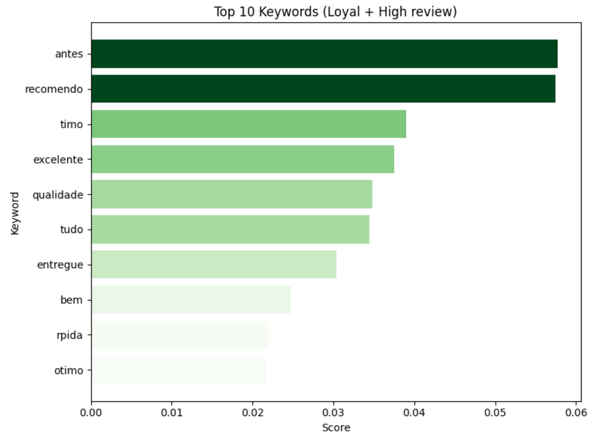

- recomendo → 추천 ⭐
- excelente / ótimo → 훌륭 ⭐
- amei / adorei → 매우 만족 ⭐
- rápido / entregue → 배송 빠름 ⭐
- qualidade → 품질 좋음

→ 추천 + 재구매 가능

**"만족했지만 재구매로 이어지지 않음"**


- Non-churn + Negative

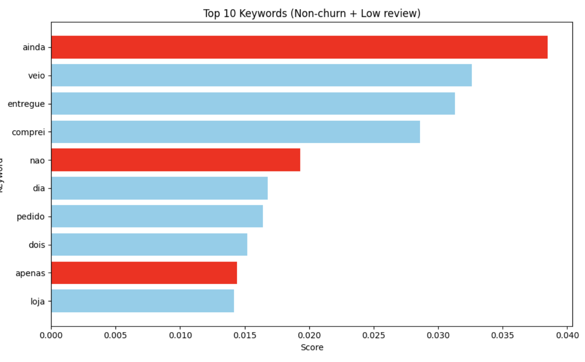

- nao → 안됨 ❗
- nada → 아무것도 없음 ❗
- defeito → 불량 ❗
- diferente → 다름 ❗
- aguardando → 기다리는 중 ❗
- frete → 배송 ❗

→ 문제 있음, 불만 있음, 아직 기다리는 상태

 **“이탈 직전 상태”**


1. **경험별 감정 분석키워드**

(Delivery / Quality / Service)

- Early churn + Negative

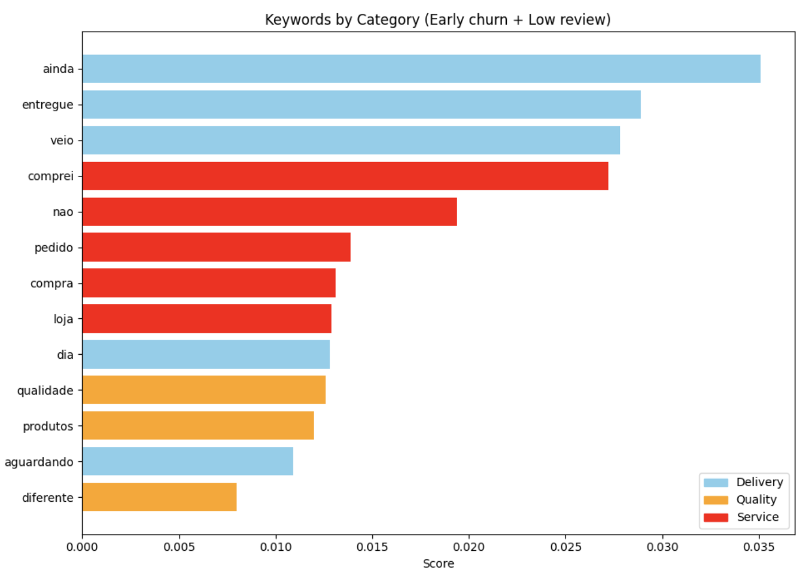

- Non-churn + Negative

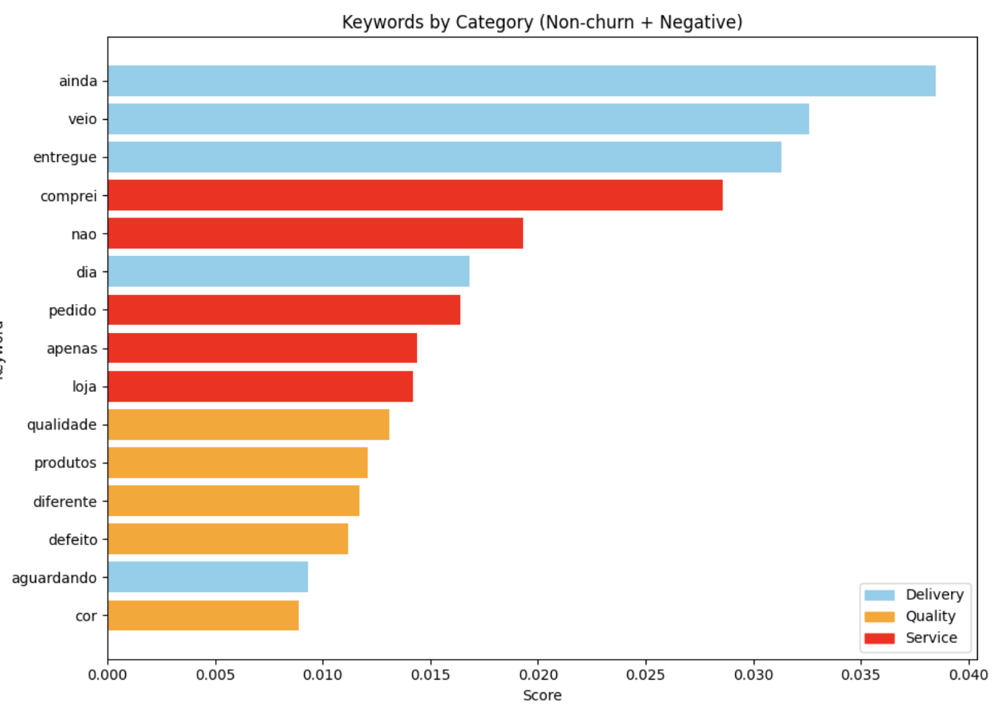

- Delivery
    - Early churn : atraso(지연), demora(지연), nao chegou(미도착)
    - Non-churn : aguardando(기다리는 중), frete(배송)
- Quality
    - Early churn : defeito(불량), diferente(다름)
    - Non-churn : defeito, problema
- Service
    - Early churn : nao, nada, quero
    - Non-churn :  nao, aguardando

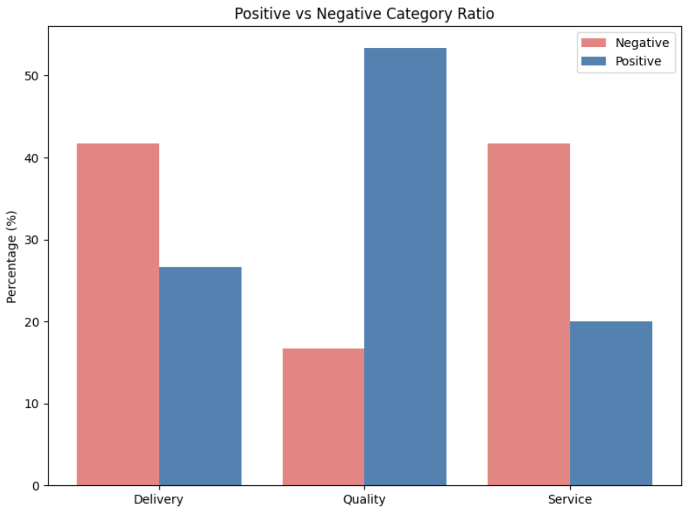

- 배송 관련 단어에서 Negative가 현저히 높게 나옴
- 품질 관련 단어에서는 Positive가 현저히 높게 나옴

---

## 비즈니스 전략 제안

| 세그먼트 | 비즈니스 전략 제안 |
| --- | --- |
| Active + Fast (VIP) | avg_gap × 1.5 시점 리마인드 · 멤버십 혜택 강화 |
| Dormant + Fast (살릴 고객) | avg_gap × 2 시점 쿠폰 자동 발송 · CRM 타이밍 최적화 |
| Loyal churn (가장 아까운) | 구매 주기 기반 리마인드 · VIP 혜택 강화 · 개인화 추천 |
| Early churn (첫 경험 실패) | 리뷰·배송 품질 개선 · 첫 구매 후 쿠폰 A/B 테스트 |

**A/B 테스트 설계:**

```
문제:  Early churn 92%
가설:  첫 구매 후 쿠폰 제공 → 재구매율 증가
A그룹: 쿠폰 없음
B그룹: 쿠폰 제공
KPI:   재구매율 · LTV
검정:  Z-test (비율 검정)
```

---

## 한계점 & 개선 방향

**현재 방식의 한계**

1. 이탈 정의 간 일관성의 한계

본 프로젝트에서는 이탈을 두 가지 방식으로 정의하였다.

- `churn_90`: 통계 분석 및 모델링을 위한 종속변수
- `lifecycle 기반 이탈`: 고객 구매 주기를 반영한 세그먼트 정의

`churn_90`은 전체 고객에 동일 기준을 적용하기 위한 단순화된 지표이며,

세그먼트 분석에서는 고객별 구매 리듬을 반영한 **개인화된 이탈 기준**을 적용하였다.

그러나 이 두 정의 간에는 다음과 같은 한계가 존재한다:

- 동일 고객이 정의에 따라 **이탈/비이탈로 다르게 분류될 수 있으며**
- 특히 장주기 구매 고객(Slow 고객)의 경우 `churn_90` 기준에서는
이탈로 분류되지만, 실제로는 정상 구매 패턴일 가능성이 존재한다
1. 인과관계 해석의 한계 (관계 분석 중심)
    
    t-test, 카이제곱, 로지스틱 회귀 분석을 통해 변수와 이탈 간의 **통계적 관계**를 확인하였으나
    
    해당 결과는 상관관계를 기반으로 한 분석이며 특정 변수(예: 배송 지연, 구매 금액)가 이탈의 **직접적인 원인이라고 단정할 수 없다**
    
2. 텍스트 감성 분석의 단순화
    
    리뷰 감성 분석은 키워드 기반으로 수행되었으며 정교한 감정 분류에는 한계가 있다
    
    - 문맥(Context)을 반영하지 못하고
    - sarcasm / 복합 감정 해석이 어려움
    - 언어적 뉘앙스(포르투갈어)의 정확한 해석 한계 존재

**개선 방향**

1. 이탈 정의 고도화

현재는 `churn_90`을 기준으로 이탈 여부를 정의하였으나, 이는 모든 고객에 동일 기준을 적용한 단순화된 방식이다. 향후에는 다음과 같은 방향으로 확장이 가능하다:

- 고객별 구매 주기를 반영한 **동적 이탈 기준 적용**
- 일정 기간 미구매 여부가 아닌,**시간 경과에 따른 이탈 확률을 추정하는 접근**
1. 예측 모델 고도화
    
    구매 주기 변화율, 이탈 확률 추정 등의 모델 설명력 및 예측 정확도를 높이기 위해 확장할 예정이다.
    
    - Gradient Boosting / XGBoost / Random Forest 적용
    - Feature Engineering 강화
2. 고객 행동 데이터 확장
    
    구매 이전 단계까지 확장한 이탈 분석을 다음 단계에 해볼 예정이다.
    
3. NLP 기반 감성 분석 고도화
    - BERT 기반 감성 분석 모델 적용
    - 토픽 모델링 (LDA)
4. 세그먼트 기반 전략 검증
    
    현재 전략은 가설 기반이므로 검증까지 확장하는 것을 목표로 할 예정이다.
    
    - 실제 A/B 테스트 수행
    - KPI (재구매율, LTV) 검증

---

## 디렉토리 구조

```
olist-churn-analysis/
├── sql/
│   ├── orders_clean.sql       # 데이터 정제
│   ├── order_gap.sql          # LAG 기반 주문 간격 계산
│   ├── customer_summary.sql   # 고객별 집계
│   └── customer_features.sql  # 최종 마트 생성
├── notebooks/
│   ├── 01_eda.ipynb           # 탐색적 분석
│   ├── 02_segment.ipynb       # 세그먼트 정의
│   ├── 03_funnel_cohort.ipynb # Funnel & Cohort 분석
│   ├── 04_stat_test.ipynb     # 통계 검정
│   ├── 05_churn_cause.ipynb   # 이탈 원인 분석
│   └── 06_sentiment.ipynb     # 감성 분석
└── README.md
```

---

## 사용 데이터셋

[Olist Brazilian E-Commerce Public Dataset — Kaggle](https://www.kaggle.com/datasets/olistbr/brazilian-ecommerce)

사용 테이블: `orders` · `customers` · `order_items` · `order_payments` · `order_reviews`
